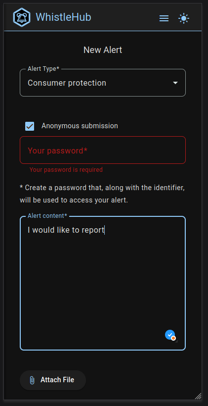
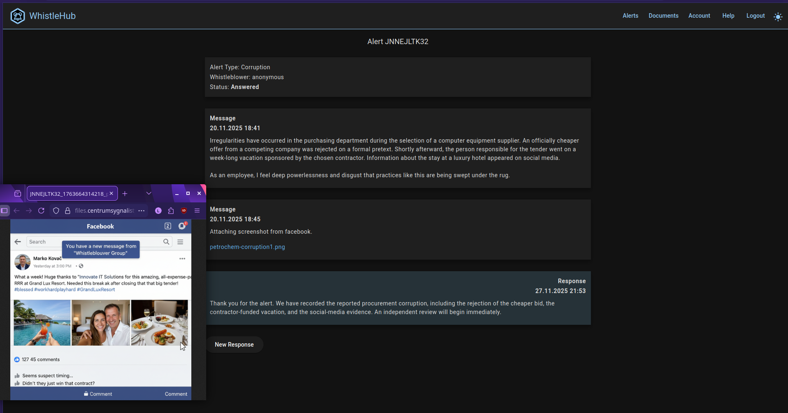

# WhistleHub - platform for Whistleblowers


> **Role:** Software Architect / Lead Developer / DevOps (End-to-End Delivery)<br>
> **Live Demo (User):** http://petrochem.whistlehub.online (intended for Mobile!) <br>
> **Live Demo (Responder):** http://petrochem.whistlehub.online/panel <br>

---

## 1. Introduction

**WhistleHub** is a secure SaaS platform designed to facilitate the reporting of workplace irregularities in strict compliance with the **Act of June 14, 2024**, on the protection of whistleblowers.

### Core Functionalities:

*   **Secure Reporting Channel**:
    Allows employees to report legal violations or irregularities within the organization. The submission form supports the upload of **evidentiary support** (PDF documents, images) to substantiate claims.

*   **Dual-Mode Anonymity**:
    *   **Named Reporting**: The whistleblower provides contact details for direct follow-up.
    *   **Anonymous Reporting**: The system ensures zero-knowledge identity protection. To enable follow-up communication without storing personal data, the system generates a unique **Case ID** combined with a **whistleblower-defined secret key**. This allows the reporter to re-access the case status and chat with responders without ever revealing their identity.

*   **Responder Dashboard**:
    A dedicated, role-based panel for organization-designated **Responders**. This interface allows for the triage of incoming alerts, internal case management, and secure, encrypted communication with the whistleblower (regardless of their anonymity status) to take appropriate follow-up actions.
    
[](./images/sample-alert-creation.png)
[](./images/sample-panel-alert.png)


### 🔒 Note on Source Code
This repository serves as a **technical showcase** and architectural documentation.
Due to the commercial nature, the full source code is private. 
This repository demonstrates the architectural decisions, technology stack, and code quality standards applied.

**I am open to a Code Review session during the technical interview to discuss implementation details.**

---

## 2. Technology Stack

A modern, cloud-native stack focused on scalability, maintainability, and developer experience.

| Layer                | Technology                  | Usage Details                                                          |
|:---------------------|:----------------------------|:-----------------------------------------------------------------------|
| **Backend**          | **Java 21 (LTS)**           | Latest language features (Records, Pattern Matching, Virtual Threads). |
| **Framework**        | **Spring Boot 3.x**         | WebMVC, Spring Security, Validation, AOP.                              |
| **Database**         | **PostgreSQL 16**           | Primary relational storage.                                            |
| **File Storage**     | **Minio 2025-10**           | S3 Compatible file storage.                                            |
| **Frontend**         | **Angular 19+**             | Standalone Components, Signals, RxJS, TypeScript.                      |
| **DevOps**           | **Docker & GitHub Actions** | Full CI/CD pipeline, automated builds and testing (pending).           |

---

## 3. High-Level Architecture

### Key Architectural Decisions:

1.  **Dual Security Contexts**:
    The application implements a "Split Domain" security architecture using Spring Security 6. Instead of a single monolithic filter chain, the system defines two distinct `SecurityFilterChain` beans:
    *   **Admin Chain (`/api/admin/**`)**: Strictly for platform administrators. It utilizes a dedicated `AdminJwtRequestFilter` and `AdminAuthenticationProvider`.
    *   **Tenant Chain (`/api/**`)**: For company users and whistleblowers. It relies on `CompanyUserJwtRequestFilter` to extract tenant context.
    *   **Rationale**: This prevents privilege escalation where a tenant user might accidentally access platform admin features. It allows distinct authentication flows (e.g., different token expirations or claim structures) for the two domains.

2.  **Stateless Multi-Tenancy**:
    The SaaS architecture is purely stateless. The "Session" is the JWT itself.
    *   **Tenant Identification**: The Tenant ID (Company ID) is embedded in the JWT claims.
    *   **Context Propagation**: Request $\rightarrow$ `CompanyUserJwtRequestFilter` $\rightarrow$ `TenantContext` (ThreadLocal) $\rightarrow$ `TenantIdentifierResolver` $\rightarrow$ Hibernate Session.
    *   **Rationale**: The primary driver is security through strict isolation. By validating the signed JWT and establishing the tenant context on every request, the system enforces hard logical boundaries. This prevents "tenant hopping" and ensures that data access is always scoped to the specific organization identified in the token, treating every interaction as a discrete, authenticated event.

## 4. Key Features & Implementation Details

### Security & Authentication
*   **Explicit Authentication Providers**: The configuration explicitly defines `DaoAuthenticationProvider` beans. This allows Controllers to inject specific providers which are completely independent of each other. Since the Administrative and Tenant domains operate on distinct database tables and user services (`AdminUserService` vs. `UserService`), this separation ensures that credential validation for one domain never interacts with the data or logic of the other.
*   **Anonymous Whistleblowing**: Endpoints such as `/api/alert/**` are explicitly configured as `.anonymous()`. This configuration forces the security context to be empty, effectively disallowing logged-in users (Responders/Managers) from accessing these endpoints. This prevents internal staff from submitting reports while acting under their official identity, preventing accidental metadata leakage or conflicts of interest.

### Multi-Tenancy Implementation
*   **Interceptor Enforcement**: A `TenantRequiredInterceptor` inspects handlers for the `@TenantRequired` annotation. It serves as a fail-safe, rejecting requests immediately if the `TenantContext` is empty before they reach the business logic.
*   **ORM Integration**: The `TenantIdentifierResolver` implements `HibernatePropertiesCustomizer` to self-register. This bridges the Spring `ThreadLocal` context directly to Hibernate, ensuring that database queries are automatically scoped to the current tenant without manual `WHERE` clauses.
*   **Safe Context Switching**: The `TenantContextRunner` utility allows background services to execute logic as a specific tenant using the "Execute Around" idiom. Crucially, this architecture mandates `spring.jpa.open-in-view: false`. Disabling OSIV defers the creation of the Hibernate Session until the transaction begins (Service layer). If OSIV were enabled, the Session would initialize at the start of the HTTP request—prior to the JWT filter execution—locking in a default tenant context and rendering the per-request tenant resolution ineffective.

### User Lifecycle Management
*   **State-Driven Activation**: Users are created with `UserStatus.PENDING_ACTIVATION`. They cannot log in until they complete a password reset flow initiated via an email token.
*   **Referential Integrity**: The `UserService` prevents the deletion of users who have generated data (messages) or hold critical roles (Manager), enforcing soft-delete logic or rejection where appropriate.
 
## 5. Code Quality Snippets

### 1. Secure Configuration: Dual Filter Chains
This configuration demonstrates the separation of concerns between Platform Administration and Tenant User access.

```java
@Configuration
@EnableWebSecurity
public class SecurityConfig {

    @Bean
    @Order(1) // Platform Admin Chain
    public SecurityFilterChain adminFilterChain(HttpSecurity http) throws Exception {
        http
            .securityMatcher("/api/admin/**")
            .sessionManagement(s -> s.sessionCreationPolicy(SessionCreationPolicy.STATELESS))
            .addFilterBefore(adminJwtRequestFilter, UsernamePasswordAuthenticationFilter.class);
        return http.build();
    }

    @Bean
    @Order(2) // Tenant User Chain
    public SecurityFilterChain userFilterChain(HttpSecurity http) throws Exception {
        http
            .authorizeHttpRequests(auth -> auth
                .requestMatchers("/api/alert/**").anonymous() // Whistleblower access
                .requestMatchers("/api/panel/**").authenticated()
            )
            .addFilterBefore(companyUserJwtRequestFilter, UsernamePasswordAuthenticationFilter.class)
            .addFilterAfter(tenantContextFilter, CompanyUserJwtRequestFilter.class);
        return http.build();
    }
}
```

### 2. Robust Multi-Tenancy: Hibernate Bridge
This snippet shows how the application automates data isolation by injecting the thread-local Tenant ID directly into the Persistence layer.

```java
@Component
public class TenantIdentifierResolver implements CurrentTenantIdentifierResolver<Long>, HibernatePropertiesCustomizer {

    @Override
    public Long resolveCurrentTenantIdentifier() {
        // Resolves tenant from ThreadLocal; defaults to -1 to prevent Hibernate configuration errors
        return TenantContext.getCurrentCompanyId().orElse(-1L);
    }

    @Override
    public void customize(Map<String, Object> hibernateProperties) {
        // Self-registration avoids fragile XML/Yaml configuration
        hibernateProperties.put(AvailableSettings.MULTI_TENANT_IDENTIFIER_RESOLVER, this);
    }
}
```

### 3. Functional Safety: Tenant Context Runner
To prevent `ThreadLocal` leaks—a common cause of data cross-contamination in multi-tenant apps—this utility guarantees cleanup using functional interfaces.

```java
@Service
public class TenantContextRunner {

    public <T> T callAsTenant(Long tenantId, Supplier<T> function) {
        Objects.requireNonNull(tenantId, "tenantId cannot be null");
        try {
            TenantContext.setCurrentCompanyId(tenantId);
            return function.get();
        } finally {
            // Critical: Ensure context is cleared even if business logic throws an exception
            TenantContext.clear();
        }
    }
}
```

### 4. Domain Logic: User Onboarding & State Transition
This service method illustrates the handling of business constraints, password security, and state transitions within a transactional boundary.

```java
@Transactional
public void registerUser(UserRegistrationRequest request) {
    // 1. Create User in PENDING state with random password
    User user = User.builder()
        .email(request.email())
        .password(passwordService.generateRandomEncodedPassword())
        .status(UserStatus.PENDING_ACTIVATION) 
        .build();
    userRepository.save(user);

    // 2. Secure Token Generation & Emailing
    String rawToken = passwordService.createResetTokenForUser(user, onboardingTokenExpirationMinutes);
    emailService.sendOnboardingEmail(user, rawToken, onboardingTokenExpirationMinutes / 60);
}
```

## 6. Deployment & Infrastructure Strategy

### 🌍 Multi-Tenancy & Domain Resolution
The application is architected as a strictly **multi-tenant SaaS platform**.
*   **Dynamic Routing:** The system identifies the active tenant based on the subdomain.
    *   *Example:* Accessing `petrochem.whistlehub.online` automatically isolates the data context for the "Petrochem" organization.
*   **Frontend Architecture:** A single, optimized Angular artifact (hosted on **OVH Web Hosting**) serves all tenants globally.

### 🏗️ Infrastructure Evolution: From Public Cloud to Private Cloud
To ensure economic viability without sacrificing performance, the infrastructure underwent a strategic migration.

#### Phase 1: AWS Cloud (Initial Deployment)
Originally architected as a cloud-native solution.
*   **Compute:** AWS EC2 & Elastic Load Balancing.
*   **Database:** AWS RDS for PostgreSQL (Managed Service).
*   **Storage:** AWS S3 for encrypted attachment storage.
*   **Outcome:** Confirmed cloud-readiness and horizontal scalability capabilities.

#### Phase 2: On-Premise Private Cloud (Current Production)
**Motivation:** Migrated to a self-hosted solution to drastically reduce operational costs (FinOps) while increasing hardware performance.

*   **Hardware Stack:** Custom **x86 server architecture** utilizing **ECC (Error Correction Code) RAM**. This is critical for ensuring data integrity and preventing corruption in sensitive compliance reports.
*   **Power Resilience:** The entire infrastructure is backed by an **Uninterruptible Power Supply (UPS)** system. This ensures immunity to power outages and voltage spikes, allowing for continuous operation to protect the ZFS storage pool.
*   **Orchestration:** Managed via **TrueNAS Scale**, leveraging containerization for application services.

### 🛡️ Data Integrity & Disaster Recovery (ZFS)
Given the sensitive nature of whistleblowing data, storage reliability is paramount. The storage layer relies on the **OpenZFS** file system:

1.  **Redundancy:** Drives configured in a **ZFS Mirror** (RAID 1) to ensure zero downtime in case of physical disk failure.
2.  **Data Safety:** Utilization of ZFS **Copy-on-Write (CoW)** and checksumming to detect and self-heal silent data corruption (bit rot).
3.  **Backup Strategy:**
    *   **Atomic Snapshots:** Instantaneous snapshots capture the system state without locking the database.
    *   **Off-site Replication:** Automated nightly replication pushes encrypted ZFS streams to a remote secondary location (also running ZFS) to guarantee business continuity (Disaster Recovery).
---

## 7. Application Preview

### Dashboard View


### Reporting Interface


---

### Contact
If you have any questions regarding the architecture or specific implementations, I'm happy to discuss them.

**https://www.linkedin.com/in/wiktorlisowicz/**